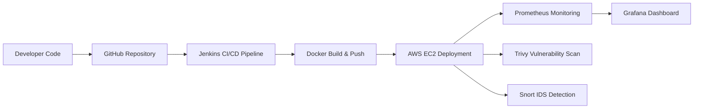

# My-project-

# 🚀 Automated Application Deployment, Security Analysis & Monitoring

---

## 📌 Project Overview

This project implements an **end-to-end secure DevSecOps pipeline** that automates:

* Application deployment on **AWS EC2**
* **Containerized delivery** using Docker
* **CI/CD automation** with Jenkins
* **Vulnerability scanning** using Trivy
* **Real-time monitoring** using Prometheus & Grafana
* **Intrusion detection** using Snort

🎯 **Goal:**
Reduce manual deployment effort, improve reliability, and ensure **continuous security & monitoring**.

---

## 🏗️ Architecture Diagram

---

## 🔄 DevSecOps Workflow

**Code → Git → Jenkins → Docker → AWS EC2 → Monitoring → Security Scan → IDS**

This pipeline ensures:

* Automated **build & deployment**
* Integrated **security scanning**
* Continuous **monitoring & alerting**
* Real-time **attack detection**

---

## 🛠️ Technologies Used

### ☁️ Cloud & Infrastructure

* **AWS EC2** – Application hosting
* **Terraform** – Infrastructure as Code

### ⚙️ DevOps & CI/CD

* **Docker** – Containerization
* **Jenkins** – CI/CD automation
* **Git & GitHub** – Version control

### 🔐 Security & Monitoring

* **Trivy** – Vulnerability scanner
* **Snort** – Intrusion Detection System
* **Prometheus** – Metrics monitoring
* **Grafana** – Visualization dashboards

---

## ✨ Key Features

✔ Automated **infrastructure provisioning**
✔ **Dockerized** application deployment
✔ Secure **CI/CD pipeline**
✔ Integrated **vulnerability scanning**
✔ Real-time **monitoring dashboards**
✔ **Intrusion detection** for attack visibility
✔ Fully **functional deployed web application**

---

## 📸 Implementation Proof

The project includes:

* Jenkins **pipeline execution stages**
* Running **deployed web application**
* GitHub **source code repository**
* Trivy **vulnerability scan report**

These confirm the system is **fully functional and production-style**, not just theoretical.

---

## 👩‍💻 My Contribution

* Configured **Terraform** for AWS EC2 provisioning
* Created & tested **Dockerfile and images**
* Assisted in **Jenkins CI/CD integration**
* Implemented **Trivy security scanning**
* Performed **testing, debugging & documentation**

---

## ⚠️ Challenges Faced

* Jenkins configuration & permission errors
* Docker dependency build failures
* AWS security group port access issues
* Understanding vulnerability scan outputs

---

## ✅ Solutions Implemented

* Debugged using **Jenkins console logs**
* Tested Docker builds **locally before deploy**
* Verified **AWS inbound rules & connectivity**
* Cross-checked vulnerabilities via **official CVE databases**

---

## 🎓 Learning Outcomes

* Real-world **DevOps pipeline implementation**
* Hands-on **cloud deployment & security integration**
* Practical exposure to **monitoring & IDS systems**

---

## 🚀 Future Scope

* Kubernetes-based orchestration
* Automated rollback on deployment failure
* SIEM integration for centralized security monitoring
* Multi-environment CI/CD (Dev / Test / Prod)

---

## 🙏 Acknowledgement

Completed as part of the **PG-DITISS program**, demonstrating
real-world integration of **DevOps, Cloud, and Cyber Security** practices.

---

## ⭐ Author

**Rishika Sharma**
PG-DITISS Final Project

Just tell me — we’ll finish your **full placement-ready project package**.
