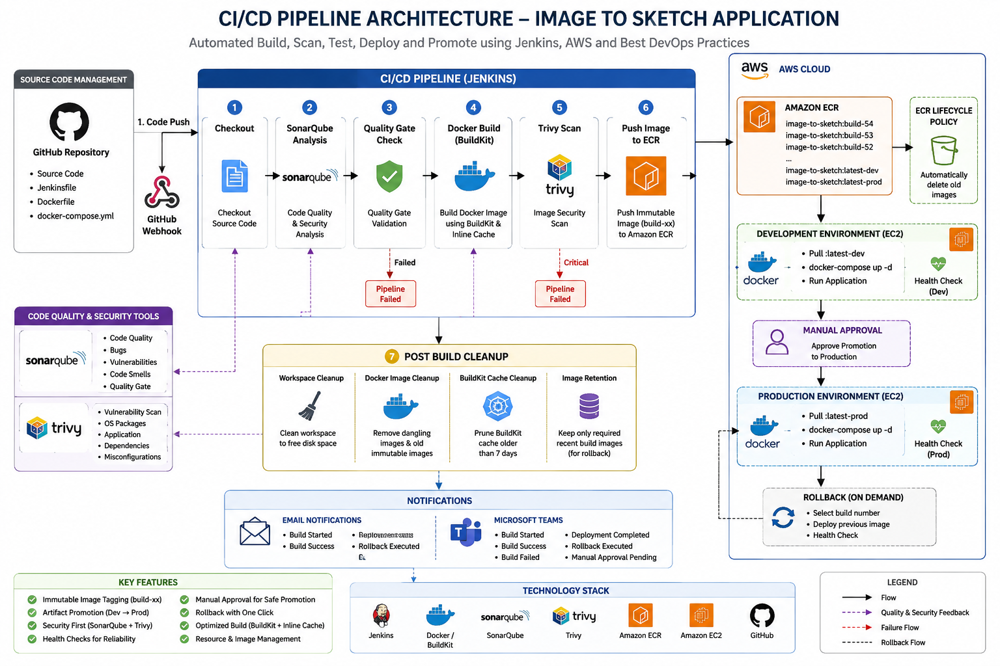
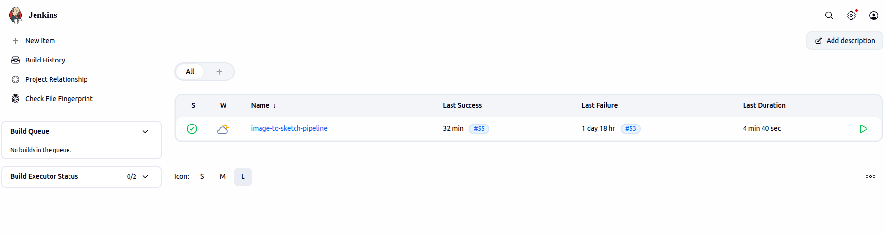
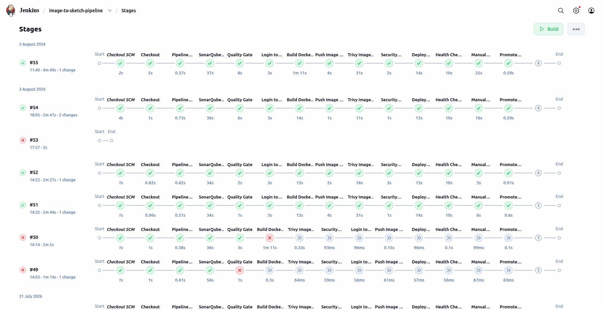
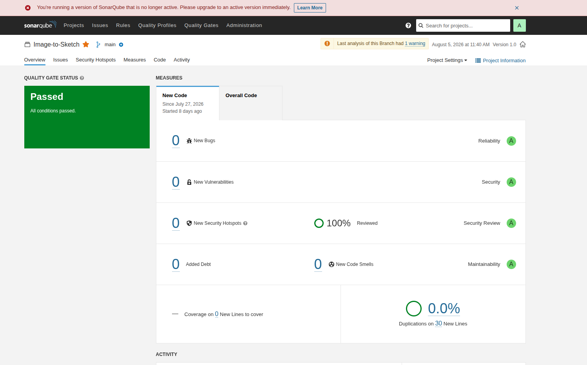
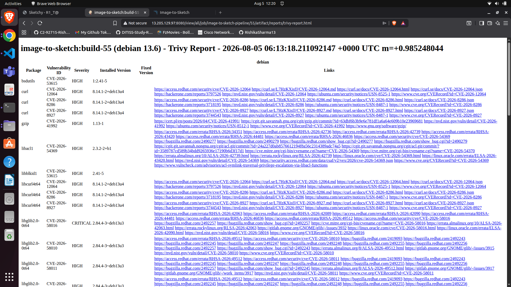
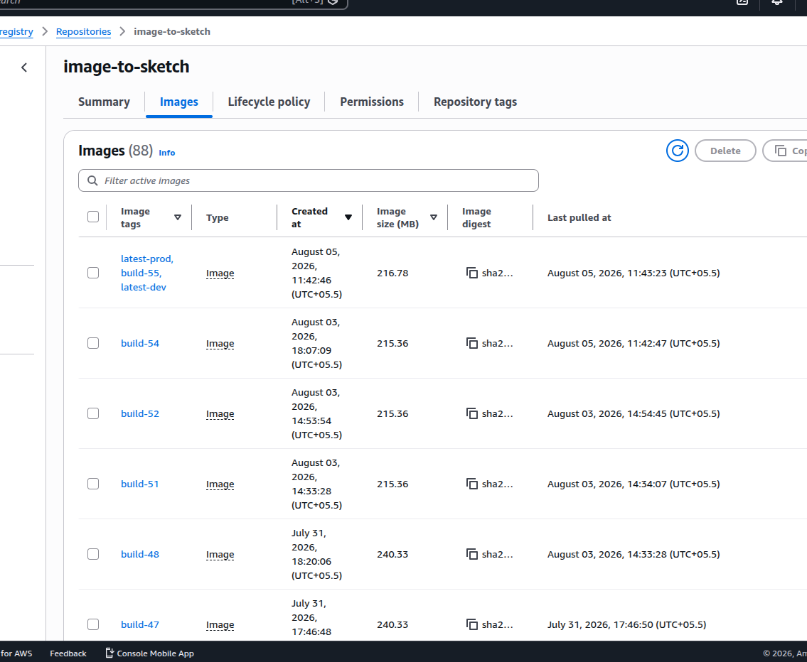
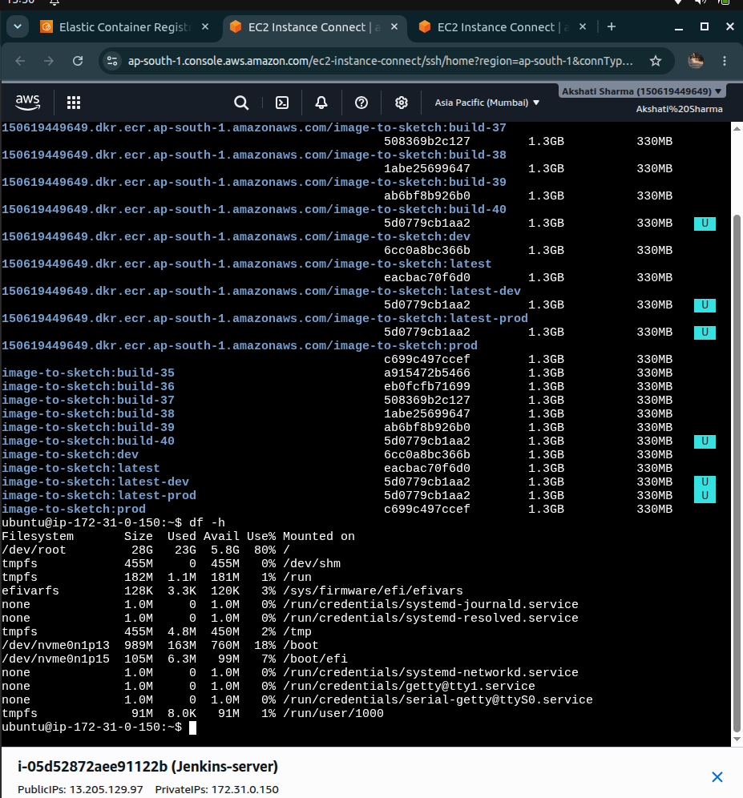
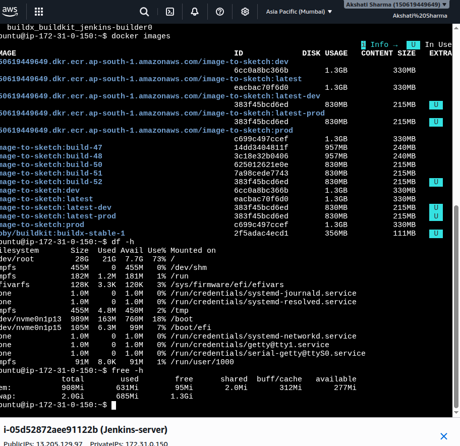

# 🚀 Production-Ready CI/CD Pipeline for Image-to-Sketch Application

## 📖 Project Overview

This project demonstrates the implementation of a **production-oriented Continuous Integration and Continuous Deployment (CI/CD) pipeline** for the **Image-to-Sketch** web application using modern DevOps practices and AWS services.

The pipeline automates the complete software delivery lifecycle, starting from source code integration to production deployment. It integrates **GitHub**, **Jenkins**, **SonarQube**, **Docker BuildKit**, **Trivy**, **Amazon ECR**, and **Amazon EC2** to ensure that every code change is automatically analyzed for quality, scanned for security vulnerabilities, containerized, versioned using immutable image tags, deployed to Development, promoted to Production, and continuously validated through health checks.

The project follows industry-standard deployment practices such as **artifact promotion**, **manual approval before production deployment**, **immutable Docker image versioning**, **production rollback**, **Docker layer caching with BuildKit**, **resource cleanup**, and **Amazon ECR lifecycle management** to build a secure, reliable, and maintainable deployment pipeline.

---
# 🛠️ Technology Stack

This project leverages a modern DevOps toolchain to automate the software delivery lifecycle, from code integration to production deployment.

| Category | Technologies |
|----------|--------------|
| **Version Control** | Git, GitHub |
| **CI/CD** | Jenkins (Declarative Pipeline) |
| **Code Quality** | SonarQube |
| **Containerization** | Docker, Docker BuildKit |
| **Container Registry** | Amazon Elastic Container Registry (Amazon ECR) |
| **Cloud Platform** | Amazon Web Services (AWS EC2) |
| **Security Scanning** | Trivy |
| **Operating System** | Ubuntu Server 22.04 LTS |
| **Web Application** | Python (Flask) |
| **Deployment** | Docker Compose |
| **Monitoring & Validation** | Health Check API (`/health`) |
| **Artifact Strategy** | Immutable Docker Image Tagging |
| **Deployment Strategy** | Artifact Promotion (Development → Production) |
| **Rollback Strategy** | Immutable Image Rollback |
| **Build Optimization** | Docker Layer Caching (BuildKit Inline Cache) |
| **Resource Management** | Docker Cleanup, BuildKit Cache Cleanup, Amazon ECR Lifecycle Policy |

---

## ⚙️ DevOps Workflow

The CI/CD pipeline integrates multiple tools to ensure every code change is automatically validated, secured, containerized, deployed, and optimized before reaching production.

```
Developer
     │
GitHub Repository
     │
GitHub Webhook
     │
Jenkins Pipeline
     │
──────────────────────────────────────
│ Checkout Source Code              │
│ SonarQube Code Analysis           │
│ Quality Gate Validation           │
│ Docker Build (BuildKit)           │
│ Trivy Image Scan                  │
│ Push Image to Amazon ECR          │
│ Deploy to Development             │
│ Health Check                      │
│ Manual Approval                   │
│ Promote Artifact                  │
│ Deploy to Production              │
│ Production Health Check           │
│ Post Build Cleanup                │
──────────────────────────────────────
```
# 🏗️ Solution Architecture

The following architecture illustrates the complete CI/CD workflow implemented for the **Image-to-Sketch** application. It demonstrates how code changes automatically move through quality analysis, security validation, containerization, deployment, and production release using industry-standard DevOps practices.

<p align="center">
    
</p>

---

## Architecture Overview

The workflow begins when a developer pushes code to the GitHub repository. A GitHub Webhook automatically triggers the Jenkins pipeline, eliminating the need for manual intervention.

The Jenkins pipeline performs a sequence of automated stages to ensure the application meets quality, security, and deployment standards before reaching production.

### CI/CD Workflow

1. **Source Code Integration**
   - Developer pushes code to GitHub.
   - GitHub Webhook automatically triggers the Jenkins pipeline.

2. **Continuous Integration**
   - Jenkins checks out the latest source code.
   - SonarQube performs static code analysis.
   - The pipeline waits for the SonarQube Quality Gate before proceeding.

3. **Container Build**
   - Docker BuildKit builds an optimized container image.
   - Docker Layer Caching reduces build time by reusing unchanged layers.
   - Immutable image tags are generated using the Jenkins build number.

4. **Security Validation**
   - Trivy scans the Docker image for High and Critical vulnerabilities.
   - Security reports are archived as Jenkins build artifacts.

5. **Container Registry**
   - The immutable Docker image is pushed to Amazon Elastic Container Registry (Amazon ECR).
   - The `latest-dev` tag is updated for Development deployments.

6. **Development Deployment**
   - Jenkins deploys the latest image to the Development environment using Docker Compose.
   - Health checks validate that the application is running successfully.

7. **Production Approval**
   - A manual approval stage prevents unintended production deployments.
   - The same immutable image is promoted without rebuilding.

8. **Production Deployment**
   - Jenkins deploys the promoted image to the Production environment.
   - Health checks verify application availability after deployment.

9. **Rollback Strategy**
   - If required, an earlier immutable image can be selected using the Rollback parameter.
   - Jenkins redeploys the selected image to restore the previous stable version.

10. **Resource Management**
    - Jenkins performs post-build cleanup.
    - Docker workspace cleanup removes unnecessary files.
    - BuildKit cache cleanup optimizes storage usage.
    - Amazon ECR Lifecycle Policy automatically removes outdated images.

---

## Architecture Highlights

- ✅ Fully automated CI/CD pipeline
- ✅ Quality Gate enforcement using SonarQube
- ✅ Security-first deployment with Trivy
- ✅ Docker BuildKit for optimized image builds
- ✅ Immutable Docker image versioning
- ✅ Artifact Promotion (Development → Production)
- ✅ Manual approval before Production deployment
- ✅ Automated Health Checks
- ✅ Production Rollback support
- ✅ Docker resource cleanup
- ✅ Amazon ECR Lifecycle Management

# ✨ Key Features

The CI/CD pipeline incorporates modern DevOps practices to ensure secure, reliable, and efficient software delivery.

---

## 🔄 Continuous Integration

- Automated GitHub Webhook integration
- Jenkins Declarative Pipeline
- Automatic source code checkout
- Continuous code integration on every commit
- Pipeline parameterization for Deploy and Rollback operations

---

## 🔍 Code Quality & Security

- SonarQube Static Code Analysis
- SonarQube Quality Gate enforcement
- Automatic pipeline termination on Quality Gate failure
- Trivy container image vulnerability scanning
- HTML and text-based security reports archived in Jenkins
- Optional security policy to fail builds on Critical vulnerabilities

---

## 🐳 Containerization & Build Optimization

- Docker BuildKit integration
- Docker Layer Caching using Inline Cache
- Optimized Dockerfile for reduced image size
- Immutable Docker image versioning using Jenkins build numbers
- Build performance optimization through cached Docker layers

---

## ☁️ AWS Integration

- Amazon Elastic Container Registry (Amazon ECR)
- Immutable Docker image storage
- Amazon EC2 deployment
- Amazon ECR Lifecycle Policy for automatic image retention
- Secure authentication using AWS CLI

---

## 🚀 Deployment Strategy

- Automated deployment to Development environment
- Health Check validation after deployment
- Manual approval before Production deployment
- Artifact Promotion from Development to Production
- Zero rebuild strategy for Production releases
- Automated Production deployment

---

## 🔁 Rollback Strategy

- Parameterized rollback pipeline
- Rollback using immutable Docker image versions
- Production redeployment without rebuilding the application
- Health Check validation after rollback

---

## 📊 Pipeline Reliability

- Automatic Health Checks for Development and Production
- Detailed Jenkins console logging
- Build timestamps for easier troubleshooting
- Archived pipeline artifacts
- Build history for traceability

---

## ⚡ Resource Optimization

- Jenkins Workspace Cleanup
- Docker image cleanup
- Docker BuildKit cache cleanup
- Disk usage optimization
- Automated post-build cleanup

---

## 🏆 Production-Ready DevOps Practices

- Immutable Image Tagging
- Artifact Promotion
- Manual Approval Gate
- Quality Gate Enforcement
- Security-First Deployment
- Docker Build Optimization
- Automated Resource Management
- Infrastructure aligned with Production CI/CD workflows

# 🔄 CI/CD Pipeline Workflow

The Jenkins pipeline automates the complete software delivery lifecycle, beginning with source code integration and ending with production deployment. Each stage is designed to ensure code quality, application security, deployment reliability, and operational efficiency.

---

## 1️⃣ Source Code Checkout

The pipeline starts by checking out the latest source code from the GitHub repository whenever a new commit is pushed.

**Purpose**
- Retrieve the latest application source code.
- Ensure the pipeline always builds the most recent version.

---

## 2️⃣ Pipeline Configuration

Pipeline parameters and environment variables are initialized.

Examples include:
- Deployment action (Deploy / Rollback)
- Build Number
- Docker Image Tag
- AWS Region
- Amazon ECR Repository

**Purpose**
- Configure the pipeline dynamically.
- Support both deployment and rollback workflows.

---

## 3️⃣ SonarQube Code Analysis

The source code is analyzed using SonarQube to identify:

- Code smells
- Bugs
- Vulnerabilities
- Security Hotspots
- Maintainability issues

**Purpose**
- Improve code quality.
- Detect issues early in the CI process.

---

## 4️⃣ Quality Gate Validation

After the analysis is complete, Jenkins waits for the SonarQube Quality Gate result.

If the Quality Gate fails:

- Pipeline execution stops immediately.
- No Docker image is built.
- No deployment occurs.

**Purpose**
- Prevent low-quality code from progressing through the pipeline.

---

## 5️⃣ Amazon ECR Authentication

Jenkins authenticates with Amazon Elastic Container Registry (Amazon ECR) before performing Docker operations.

**Purpose**
- Allow Docker to pull and push container images securely.

---

## 6️⃣ Docker Image Build

The application is containerized using **Docker BuildKit**.

The pipeline:

- Builds an optimized Docker image.
- Uses Docker Layer Caching for faster builds.
- Generates an immutable image tag using the Jenkins Build Number.

Example:

```
build-54
```

**Purpose**

- Create reproducible Docker images.
- Improve build performance.
- Support immutable deployments.

---

## 7️⃣ Trivy Security Scan

The generated Docker image is scanned using Trivy.

The scan checks for:

- High vulnerabilities
- Critical vulnerabilities
- Known CVEs

Security reports are archived as Jenkins build artifacts.

**Purpose**

- Ensure container security before deployment.

---

## 8️⃣ Security Policy Validation

An optional security policy can terminate the pipeline if Critical vulnerabilities are detected.

**Purpose**

- Prevent insecure container images from reaching production.

---

## 9️⃣ Push Docker Image to Amazon ECR

The validated Docker image is pushed to Amazon ECR.

The pipeline publishes:

- Immutable build image
- Development image tag

Example:

```
build-54
latest-dev
```

**Purpose**

- Store versioned container images.
- Enable reproducible deployments.
- Support future rollback.

---

## 🔟 Deploy to Development Environment

The latest development image is deployed using Docker Compose.

Deployment includes:

- Pull latest image
- Stop previous containers
- Start updated containers

**Purpose**

- Validate the application before production.

---

## 1️⃣1️⃣ Development Health Check

Jenkins verifies that the deployed application is healthy by calling the Health Check API.

Example:

```
GET /health
```

**Purpose**

- Confirm successful deployment.
- Detect runtime failures immediately.

---

## 1️⃣2️⃣ Manual Approval

Production deployment requires manual approval.

This prevents accidental deployments.

**Purpose**

- Introduce human validation before Production.

---

## 1️⃣3️⃣ Artifact Promotion

Instead of rebuilding the application, the same immutable Docker image is promoted to Production.

Example:

```
build-54
        ↓
latest-prod
```

**Purpose**

- Guarantee that the exact image tested in Development is deployed to Production.
- Eliminate inconsistencies between environments.

---

## 1️⃣4️⃣ Deploy to Production

The promoted image is deployed using Docker Compose.

Deployment process:

- Pull Production image
- Replace running containers
- Start updated application

**Purpose**

- Perform reliable Production deployment.

---

## 1️⃣5️⃣ Production Health Check

After deployment, Jenkins validates the Production application.

**Purpose**

- Ensure the application is available.
- Verify successful deployment.

---

## 1️⃣6️⃣ Post Build Cleanup

After a successful deployment, Jenkins performs cleanup operations.

Cleanup includes:

- Jenkins Workspace Cleanup
- Docker Image Cleanup
- Docker BuildKit Cache Cleanup
- Docker Resource Optimization

**Purpose**

- Reduce disk usage.
- Keep the Jenkins server clean.
- Improve long-term pipeline stability.

---

## 1️⃣7️⃣ Production Rollback

If required, the pipeline can redeploy any previously generated immutable image.

The rollback process:

- Pull selected build image
- Update Production tag
- Redeploy application
- Perform Health Check

**Purpose**

- Restore the last stable version quickly.
- Reduce downtime during production failures.

# 🚀 Deployment Strategy

The project follows a **production-oriented deployment strategy** that ensures only validated and tested artifacts are promoted to Production. Instead of rebuilding the application for each environment, the pipeline follows an **Artifact Promotion** approach where the exact Docker image tested in Development is promoted to Production.

---

## Development Deployment

Every successful pipeline execution automatically deploys the application to the **Development environment**.

The deployment process includes:

1. Pull the latest Development image (`latest-dev`) from Amazon ECR.
2. Stop existing application containers.
3. Deploy the updated container using Docker Compose.
4. Execute a Health Check (`/health`) to verify the deployment.

This environment is used to validate the application before Production release.

---

## Production Deployment

Production deployment is protected by a **Manual Approval** stage.

Once approval is granted:

1. The previously tested immutable Docker image is promoted to the `latest-prod` tag.
2. The Production server pulls the promoted image from Amazon ECR.
3. Existing containers are replaced with the updated version.
4. A Production Health Check validates the deployment.

This ensures that the exact artifact tested in Development is deployed to Production, eliminating inconsistencies between environments.

---

## Artifact Promotion

The pipeline follows an **Artifact Promotion** strategy instead of rebuilding the application for Production.

Example:

```
Jenkins Build
      │
      ▼
Docker Image (build-54)
      │
      ▼
Development Deployment
      │
      ▼
Health Check
      │
      ▼
Manual Approval
      │
      ▼
Production Deployment
```

### Benefits

- Same artifact is used in every environment.
- Eliminates rebuild inconsistencies.
- Improves deployment reliability.
- Simplifies rollback.
- Supports immutable deployments.

---

## Immutable Image Versioning

Each pipeline execution generates a unique immutable Docker image.

Example:

```
build-51
build-52
build-53
build-54
```

Environment tags are then updated accordingly.

```
latest-dev
latest-prod
```

This strategy provides:

- Complete deployment traceability
- Version history
- Easy rollback
- Reproducible deployments

---

## Health Validation

Health checks are executed after every deployment.

Development:

```
GET /health
```

Production:

```
GET /health
```

Deployment is considered successful only when the application returns a healthy response.

---

## Rollback Strategy

If a Production deployment encounters issues, Jenkins supports rollback using immutable Docker image versions.

The rollback workflow performs the following steps:

1. Select the required build number.
2. Pull the corresponding immutable image from Amazon ECR.
3. Update the `latest-prod` tag.
4. Redeploy the application.
5. Execute a Production Health Check.

This approach minimizes downtime while ensuring rapid recovery to a previously validated application version.

# 🔒 Security Implementation

Security has been integrated throughout the CI/CD pipeline to ensure that only high-quality and secure application artifacts are deployed to Production.

---

## SonarQube Static Code Analysis

The pipeline performs automated static code analysis using **SonarQube** immediately after checking out the source code.

SonarQube analyzes the application for:

- Bugs
- Code Smells
- Vulnerabilities
- Security Hotspots
- Maintainability Issues

The generated analysis report provides insights into code quality before the application is containerized.

---

## Quality Gate Enforcement

After the SonarQube analysis completes, Jenkins waits for the **Quality Gate** result.

The pipeline is automatically terminated if the Quality Gate status is **Failed**.

This prevents:

- Low-quality code
- Unresolved critical issues
- Applications that do not meet predefined quality standards

from progressing to the deployment stages.

---

## Container Security Scanning

Once the Docker image is built, the pipeline performs an image vulnerability scan using **Trivy**.

The scan identifies:

- Operating System vulnerabilities
- Package vulnerabilities
- Known CVEs (Common Vulnerabilities and Exposures)
- High and Critical severity issues

Both HTML and text reports are generated and archived as Jenkins build artifacts for future reference.

---

## Security Policy Validation

The pipeline includes a configurable security policy that can automatically fail the deployment if **Critical vulnerabilities** are detected during the Trivy scan.

This provides an additional security gate before container images are published.

---

## Immutable Docker Images

Every build generates a unique immutable Docker image.

Example:

```
build-51
build-52
build-53
```

Once published, these images are never modified.

This strategy:

- Prevents accidental image overwrites
- Ensures deployment traceability
- Supports reliable rollback
- Improves deployment consistency

---

## Controlled Production Deployment

Production deployments are protected through a **Manual Approval** stage.

This prevents accidental releases and ensures that production deployments are performed only after validation and explicit approval.

---

## Health Check Validation

After every Development and Production deployment, the application health is validated using the `/health` endpoint.

Deployment is considered successful only if the application responds with a healthy status.

This prevents unhealthy deployments from being considered successful.

---

## Secure Container Registry

Docker images are securely stored in **Amazon Elastic Container Registry (Amazon ECR)**.

The pipeline authenticates with Amazon ECR using the AWS CLI before performing image push or pull operations.

Amazon ECR serves as the centralized repository for:

- Immutable build images
- Development images
- Production images

---

## Security Best Practices Implemented

The pipeline incorporates several security-focused DevOps practices:

- Static Application Security Testing (SAST) using SonarQube
- Automated Quality Gate enforcement
- Container vulnerability scanning with Trivy
- Immutable Docker image versioning
- Secure image storage using Amazon ECR
- Manual approval before Production deployment
- Automated Health Check validation
- Secure artifact promotion without rebuilding

# ⚡ Performance Optimizations

To improve build efficiency, reduce resource consumption, and enhance the overall reliability of the CI/CD pipeline, several performance optimization techniques have been implemented.

---

## Docker BuildKit

The pipeline uses **Docker BuildKit** as the build engine instead of the traditional Docker builder.

### Benefits

- Faster image builds
- Improved parallel execution
- Better cache management
- Reduced build time
- Optimized image generation

---

## Docker Layer Caching

Docker Layer Caching is enabled using **BuildKit Inline Cache**.

Instead of rebuilding every Docker layer for each pipeline execution, unchanged layers are reused from previous builds.

### Cached Layers

- Base Python image
- Operating system packages
- Python dependencies
- Application dependencies

Only the modified application source code layer is rebuilt.

### Benefits

- Faster Docker builds
- Reduced CPU utilization
- Reduced network usage
- Improved developer productivity

---

## Optimized Dockerfile

The Dockerfile was optimized to improve build performance and reduce image size.

### Optimizations

- Lightweight `python:3.10-slim` base image
- Dependency installation before application source code
- Improved Docker layer ordering
- Removal of unnecessary package cache
- Reduced final image size

These optimizations allow Docker to reuse dependency layers even when application code changes.

---

## Immutable Image Tagging

Each Jenkins build produces a uniquely versioned Docker image.

Example:

```
build-51
build-52
build-53
```

This approach eliminates image overwrite issues and improves deployment consistency.

### Benefits

- Complete deployment traceability
- Reliable rollback
- Version-controlled deployments
- Reproducible releases

---

## Artifact Promotion

The pipeline follows an **Artifact Promotion** strategy.

Instead of rebuilding the application for Production, the same Docker image validated in the Development environment is promoted.

### Benefits

- Eliminates rebuild inconsistencies
- Faster Production deployments
- Higher deployment reliability
- Consistent artifacts across environments

---

## Jenkins Workspace Cleanup

After every pipeline execution, the Jenkins workspace is automatically cleaned.

### Benefits

- Prevents unnecessary disk usage
- Removes temporary build files
- Keeps Jenkins agents clean
- Improves long-term server stability

---

## Docker Resource Cleanup

The pipeline performs automated Docker cleanup after successful deployments.

Cleanup includes:

- Dangling image removal
- Docker BuildKit cache cleanup
- Local Docker image cleanup

### Benefits

- Reduces disk consumption
- Prevents accumulation of unused images
- Optimizes Docker storage

---

## Amazon ECR Lifecycle Policy

Amazon ECR Lifecycle Policies automatically remove outdated container images from the registry.

### Benefits

- Prevents registry growth
- Reduces storage costs
- Simplifies image management
- Maintains only recent image versions

---

## Pipeline Logging Improvements

The Jenkins pipeline includes enhanced console logging for easier troubleshooting.

Features include:

- Stage separators
- Informative status messages
- Build timestamps
- Clear deployment progress
- Health check results
- Cleanup summaries

These improvements simplify debugging and improve pipeline observability.

---

## Overall Optimization Summary

The pipeline incorporates multiple optimizations to improve efficiency and maintainability:

- ✅ Docker BuildKit
- ✅ Docker Layer Caching (Inline Cache)
- ✅ Optimized Dockerfile
- ✅ Immutable Image Tagging
- ✅ Artifact Promotion
- ✅ Jenkins Workspace Cleanup
- ✅ Docker Resource Cleanup
- ✅ Amazon ECR Lifecycle Policy
- ✅ Enhanced Pipeline Logging
- ✅ Build Performance Optimization

# 📂 Project Structure

The repository is organized to separate the application source code, deployment configurations, CI/CD pipeline, and documentation for better maintainability.

```text
image-to-sketch/
│
├── Jenkinsfile                 # Declarative Jenkins CI/CD Pipeline
├── Dockerfile                  # Docker image build instructions
├── docker-compose.dev.yml      # Development deployment configuration
├── docker-compose.prod.yml     # Production deployment configuration
├── .gitignore                  # Git ignore rules
├── README.md                   # Project documentation
│
├── app.py                      # Flask application entry point
├── requirements.txt            # Python dependencies
├── templates/                  # HTML templates
├── static/                     # CSS, JavaScript, Images
│
├── docs/
│   ├── images/
│   │   ├── architecture.png
│   │   ├── jenkins-dashboard.png
│   │   ├── sonar-dashboard.png
│   │   ├── trivy-report.png
│   │   └── pipeline-success.png
│   │
│   └── project-documentation.pdf
│
└── reports/
    ├── trivy-report.html
    └── trivy-report.txt
```

> **Note:** The directory structure shown above represents the logical organization of the project. The exact structure may vary depending on future enhancements or additional project assets.

---

## 📁 Repository Components

### Jenkinsfile

Contains the complete Declarative Jenkins Pipeline responsible for:

- Source Code Checkout
- SonarQube Analysis
- Quality Gate Validation
- Docker Build (BuildKit)
- Trivy Security Scan
- Amazon ECR Push
- Development Deployment
- Production Deployment
- Rollback
- Health Checks
- Post-build Cleanup

---

### Dockerfile

Defines the Docker image used to containerize the Flask application.

Key characteristics:

- Python 3.10 Slim base image
- Optimized build layers
- Docker BuildKit compatible
- Production-ready image

---

### Docker Compose Files

The project uses separate Docker Compose files for different environments.

**Development**

```
docker-compose.dev.yml
```

Responsible for deploying the Development environment.

**Production**

```
docker-compose.prod.yml
```

Responsible for Production deployment.

---

### Application Source Code

Contains the Flask-based Image-to-Sketch web application.

Includes:

- Application logic
- HTML templates
- Static resources
- Python dependencies

---

### Documentation

The `docs/` directory contains:

- Architecture Diagram
- Project Screenshots
- Technical Documentation
- Deployment Workflow

---

### Security Reports

Generated during every Jenkins build.

Includes:

- Trivy HTML Report
- Trivy Text Report

These reports are archived as Jenkins build artifacts for future reference.

# 🚀 Getting Started

Follow the steps below to set up and execute the project in your own environment.

---

## Prerequisites

Ensure the following software and services are installed and configured before running the project.

| Software / Service | Version |
|--------------------|---------|
| Git | Latest Stable Version |
| Docker | 29.x or later |
| Docker Compose | Latest Stable Version |
| Jenkins | Latest LTS |
| SonarQube | Community Edition |
| Trivy | Latest Stable Version |
| AWS CLI | Version 2 |
| Python | 3.10 |
| Ubuntu Server | 22.04 LTS |
| Amazon EC2 Instance | Ubuntu 22.04 |
| Amazon ECR Repository | Configured |

---

# 1️⃣ Clone the Repository

```bash
git clone https://github.com/<your-github-username>/<repository-name>.git

cd <repository-name>
```

---

# 2️⃣ Configure Jenkins

Create a Jenkins Pipeline Job and configure the following:

- Connect Jenkins with the GitHub repository.
- Configure a GitHub Webhook for automatic builds.
- Add the required Jenkins credentials.
- Install the required Jenkins plugins:
  - Git
  - Docker
  - Pipeline
  - SonarQube Scanner
  - HTML Publisher
  - Timestamper

---

# 3️⃣ Configure SonarQube

1. Start the SonarQube server.
2. Generate a SonarQube authentication token.
3. Configure the SonarQube server in Jenkins.
4. Add the authentication token as Jenkins credentials.

---

# 4️⃣ Configure AWS

Create and configure:

- Amazon ECR Repository
- Amazon EC2 Instance
- IAM User with ECR permissions

Configure AWS CLI:

```bash
aws configure
```

Provide:

- AWS Access Key
- AWS Secret Key
- AWS Region
- Output Format

---

# 5️⃣ Install Docker & Docker Compose

Install Docker:

```bash
sudo apt update

sudo apt install docker.io -y
```

Install Docker Compose:

```bash
sudo apt install docker-compose-plugin -y
```

Verify installation:

```bash
docker --version

docker compose version
```

---

# 6️⃣ Install Trivy

```bash
sudo apt-get install wget apt-transport-https gnupg lsb-release

wget -qO - https://aquasecurity.github.io/trivy-repo/deb/public.key \
| sudo gpg --dearmor -o /usr/share/keyrings/trivy.gpg

echo "deb [signed-by=/usr/share/keyrings/trivy.gpg] \
https://aquasecurity.github.io/trivy-repo/deb $(lsb_release -sc) main" \
| sudo tee /etc/apt/sources.list.d/trivy.list

sudo apt update

sudo apt install trivy -y
```

Verify:

```bash
trivy --version
```

---

# 7️⃣ Configure Pipeline Environment Variables

Configure the required environment variables in the Jenkins Pipeline.

Example:

```text
AWS_REGION
ECR_REPO
IMAGE_NAME
DEPLOY_PATH
LOCAL_IMAGE_RETENTION
```

---

# 8️⃣ Run the Pipeline

Push any code change to the GitHub repository.

The GitHub Webhook automatically triggers the Jenkins Pipeline.

Pipeline execution:

```
Checkout
    ↓
SonarQube Analysis
    ↓
Quality Gate
    ↓
Docker Build (BuildKit)
    ↓
Trivy Scan
    ↓
Push to Amazon ECR
    ↓
Deploy Development
    ↓
Health Check
    ↓
Manual Approval
    ↓
Deploy Production
    ↓
Health Check
    ↓
Cleanup
```

---

# 9️⃣ Verify Deployment

Development

```
http://<development-server-ip>:4000
```

Production

```
http://<production-server-ip>:4000
```

Health Check

```bash
curl http://<server-ip>:4000/health
```

Expected Response:

```json
{
    "application": "Image-to-Sketch",
    "status": "UP",
    "version": "1.0"
}
```

---

# 🔟 Rollback

To perform a rollback:

1. Start the Jenkins Pipeline.
2. Select **Rollback** as the pipeline action.
3. Enter the required immutable build number.
4. Execute the pipeline.

Example:

```
Rollback Build Number

51
```

The pipeline will:

- Pull the selected immutable image
- Promote it to `latest-prod`
- Redeploy the application
- Execute a Production Health Check

---

## ✅ Expected Outcome

After successful execution, the pipeline will:

- Perform code quality analysis.
- Validate the Quality Gate.
- Scan the Docker image for vulnerabilities.
- Build an optimized Docker image.
- Push immutable images to Amazon ECR.
- Deploy to Development.
- Validate application health.
- Promote the artifact to Production.
- Deploy to Production.
- Execute Health Checks.
- Clean up Docker resources.

# 📸 Project Screenshots

The following screenshots provide a visual overview of the CI/CD pipeline, deployment workflow, security validation, and AWS infrastructure.

---

## 1. CI/CD Pipeline Architecture

Illustrates the complete DevOps workflow from source code integration to production deployment.

<p align="center">
    
</p>

---

## 2. Jenkins Dashboard

Shows the configured Jenkins pipeline and build history.

<p align="center">
    
</p>

---

## 3. Successful Pipeline Execution

Demonstrates a successful end-to-end CI/CD pipeline execution including:

- Source Code Checkout
- SonarQube Analysis
- Quality Gate Validation
- Docker Build
- Trivy Scan
- Amazon ECR Push
- Development Deployment
- Manual Approval
- Production Deployment
- Post Build Cleanup

<p align="center">
    
</p>

---

## 4. SonarQube Dashboard

Displays the code quality analysis results including:

- Bugs
- Vulnerabilities
- Code Smells
- Security Hotspots
- Maintainability Rating
- Quality Gate Status

<p align="center">
    
</p>

---

## 5. Trivy Security Scan Report

Illustrates the container image vulnerability scan performed before deployment.

The report includes:

- Critical Vulnerabilities
- High Vulnerabilities
- Installed Packages
- CVE Details

<p align="center">
    
</p>

---

## 6. Amazon ECR Repository

Shows immutable Docker image versions stored in Amazon Elastic Container Registry.

Example image tags:

- build-51
- build-52
- build-53
- latest-dev
- latest-prod

<p align="center">
    
</p>

---

## 7. Production Deployment

Shows the application successfully deployed in the Production environment after manual approval.

<p align="center">
    
</p>

---

## 8. Rollback Execution

Illustrates the rollback process using an immutable Docker image version.

The screenshot demonstrates:

- Rollback parameter
- Selected Build Number
- Successful rollback deployment
- Production Health Check

<p align="center">
    
</p>

---

## 9. Docker Image Management

Demonstrates Docker image optimization and resource cleanup after successful deployments.

Highlights:

- Docker BuildKit
- Layer Caching
- Image Cleanup
- BuildKit Cache Cleanup
- Reduced Disk Usage

<p align="center">
    
    
</p>

---

## 10. Health Check Validation

Shows successful application health verification after deployment.

Example response:

```json
{
    "application": "Image-to-Sketch",
    "status": "UP",
    "version": "1.0"
}
```

# 🚀 Future Enhancements

Although the current implementation provides a production-oriented CI/CD pipeline, several enhancements can be incorporated to further improve automation, scalability, security, and operational efficiency.

---

## 📧 Notification Integration

Implement automated notifications to keep the development team informed about pipeline events.

Possible integrations include:

- Email Notifications
- Microsoft Teams Notifications
- Slack Notifications

Notifications can be triggered for:

- Successful Builds
- Failed Builds
- Production Deployments
- Rollback Executions
- Security Scan Failures

---

## ☸️ Kubernetes Deployment

Replace Docker Compose deployments with Kubernetes for improved scalability and container orchestration.

Potential enhancements include:

- Kubernetes Deployments
- Services
- Ingress
- ConfigMaps
- Secrets
- Horizontal Pod Autoscaling

---

## 📦 Helm Chart Integration

Package the application using Helm Charts to simplify deployments across multiple environments.

Benefits include:

- Version-controlled deployments
- Easier configuration management
- Environment-specific values
- Reusable deployment templates

---

## 🌍 Infrastructure as Code (IaC)

Provision the complete infrastructure using Terraform.

Resources that can be automated include:

- Amazon VPC
- EC2 Instances
- Security Groups
- Amazon ECR
- IAM Roles
- Application Load Balancer
- Auto Scaling Groups

---

## 📊 Monitoring & Observability

Integrate monitoring tools to improve application visibility.

Possible integrations:

- Prometheus
- Grafana
- Node Exporter
- cAdvisor

Monitoring metrics may include:

- CPU Usage
- Memory Usage
- Disk Usage
- Container Health
- Application Availability

---

## 📈 Deployment Strategies

Implement advanced deployment strategies to reduce deployment risks.

Possible approaches:

- Blue-Green Deployment
- Canary Deployment
- Rolling Updates

These strategies help minimize downtime and improve release confidence.

---

## 🔐 Secrets Management

Replace environment variables containing sensitive information with a centralized secrets management solution.

Possible options:

- AWS Secrets Manager
- AWS Systems Manager Parameter Store
- HashiCorp Vault

---

## 🔄 GitOps Implementation

Adopt a GitOps workflow using tools such as Argo CD or Flux CD.

Benefits include:

- Declarative deployments
- Automatic synchronization
- Improved version control
- Easier rollback management

---

## 🤖 Automated Testing

Extend the pipeline by incorporating automated testing stages.

Potential additions:

- Unit Testing
- Integration Testing
- API Testing
- End-to-End Testing
- Performance Testing

---

## 📊 Pipeline Analytics

Enhance Jenkins reporting by collecting and visualizing pipeline metrics such as:

- Build Duration
- Deployment Frequency
- Pipeline Success Rate
- Mean Time to Recovery (MTTR)
- Lead Time for Changes

---

## 🎯 Long-Term Vision

The long-term objective is to evolve this project into a complete enterprise-grade DevOps platform by integrating Infrastructure as Code, Kubernetes, GitOps, advanced monitoring, automated testing, and intelligent deployment strategies while maintaining security, reliability, and operational efficiency throughout the software delivery lifecycle.

# 📚 Key Learnings

Developing this project provided hands-on experience with designing, implementing, troubleshooting, and optimizing a production-oriented CI/CD pipeline. Beyond learning individual tools, the project reinforced how different DevOps components work together to automate software delivery while maintaining quality, security, and reliability.

---

## CI/CD Pipeline Design

- Designed and implemented an end-to-end CI/CD pipeline using Jenkins Declarative Pipeline.
- Understood the complete software delivery lifecycle from source code integration to production deployment.
- Learned how to structure pipeline stages for maintainability and scalability.

---

## Code Quality & Security

- Integrated SonarQube to perform automated static code analysis.
- Implemented Quality Gate validation to prevent low-quality code from progressing through the pipeline.
- Integrated Trivy to perform container vulnerability scanning before deployment.
- Understood the importance of incorporating security checks early in the CI/CD lifecycle.

---

## Docker & Containerization

- Built and optimized Docker images for a Python Flask application.
- Improved Docker image efficiency by optimizing the Dockerfile.
- Learned Docker BuildKit and its advantages over the traditional Docker build process.
- Implemented Docker Layer Caching using BuildKit Inline Cache to improve build performance.

---

## Troubleshooting & Optimization

This project involved solving several practical issues encountered during implementation, including:

- Investigating Docker BuildKit configuration issues.
- Troubleshooting the **BuildKit Registry Cache (403 Forbidden)** error while exporting cache to Amazon ECR.
- Migrating from Registry Cache to **Inline Cache** as a more suitable caching strategy.
- Debugging Jenkins pipeline syntax and execution issues.
- Optimizing Docker resource usage through automated cleanup.
- Reducing Jenkins server disk utilization by implementing Docker image cleanup, BuildKit cache cleanup, and Amazon ECR Lifecycle Policies.

These troubleshooting activities improved my understanding of debugging production CI/CD pipelines.

---

## Deployment Strategy

- Implemented immutable Docker image versioning using Jenkins build numbers.
- Learned the importance of Artifact Promotion instead of rebuilding artifacts for Production.
- Implemented separate Development and Production deployment workflows.
- Added Manual Approval before Production deployment.
- Implemented Health Check validation after every deployment.
- Developed a parameterized Production Rollback mechanism using immutable Docker images.

---

## AWS Integration

- Integrated Jenkins with Amazon Elastic Container Registry (Amazon ECR).
- Managed container image versioning using immutable tags.
- Configured Amazon EC2 for application deployment.
- Implemented Amazon ECR Lifecycle Policies for automated image retention.

---

## Resource Management

- Implemented Jenkins Workspace Cleanup.
- Configured Docker image cleanup after successful deployments.
- Implemented Docker BuildKit cache cleanup.
- Improved storage utilization on the Jenkins server by reducing unnecessary Docker resources.

---

## Best Practices Adopted

Throughout the project, several production-oriented DevOps practices were implemented, including:

- Immutable Docker Image Tagging
- Artifact Promotion
- Manual Approval before Production Deployment
- Automated Health Checks
- Security-First CI/CD
- Docker Build Optimization
- Automated Resource Cleanup
- Version-controlled deployments
- Reproducible releases

---

## Overall Learning Outcome

This project significantly strengthened my understanding of modern DevOps practices by providing practical experience with CI/CD automation, code quality enforcement, container security, Docker optimization, AWS deployment, troubleshooting, and production deployment strategies.

More importantly, it demonstrated that building a reliable CI/CD pipeline is not only about automating deployments, but also about ensuring quality, security, performance, maintainability, and operational reliability throughout the software delivery lifecycle.

# 🤝 Contributing

Contributions are welcome to help improve the project and expand its capabilities. Whether it's fixing bugs, improving documentation, optimizing the CI/CD pipeline, or introducing new features, all contributions are appreciated.

---

## How to Contribute

1. Fork the repository.
2. Create a new feature or bug-fix branch.

```bash
git checkout -b feature/your-feature-name
```

3. Make the required changes and test them thoroughly.

4. Commit your changes using meaningful commit messages.

```bash
git commit -m "feat: add Jenkins email notification support"
```

5. Push the branch to your fork.

```bash
git push origin feature/your-feature-name
```

6. Open a Pull Request with a clear description of the proposed changes.

---

## Contribution Guidelines

Please ensure that:

- The project builds successfully.
- Jenkins pipeline execution is not affected.
- Docker images build successfully.
- Code changes follow existing project structure.
- Documentation is updated whenever new functionality is added.
- Commit messages follow the Conventional Commits format where possible.

---

## Areas for Contribution

Contributors can help improve the project by working on:

- Email Notifications
- Microsoft Teams / Slack Integration
- Kubernetes Deployment
- Helm Chart Support
- Terraform Infrastructure Automation
- Prometheus & Grafana Monitoring
- Automated Testing
- GitOps Integration (Argo CD / Flux CD)
- Blue-Green Deployment
- Canary Deployment
- Performance Improvements
- Documentation Enhancements

---

## Reporting Issues

If you discover a bug or have suggestions for improvement, please create a GitHub Issue including:

- Description of the issue
- Steps to reproduce
- Expected behavior
- Actual behavior
- Screenshots (if applicable)
- Environment details

---

## Code of Conduct

Please be respectful and constructive when contributing to this project. Feedback, suggestions, and improvements are always welcome.

# 👨‍💻 Author

## About the Author

Hi! I'm **Rishika Sharma**, a DevOps Engineer passionate about building reliable, secure, and production-ready automation solutions.

This project was developed as part of my hands-on learning journey to gain practical experience with modern DevOps tools and best practices. Throughout the implementation, I focused on designing a CI/CD pipeline that emphasizes automation, code quality, security, deployment reliability, and performance optimization.

---

## Connect With Me

- **GitHub:** https://github.com/RishikaSharma13
- **LinkedIn:** *Add your LinkedIn profile URL here*
- **Email:** *Add your professional email address (optional)*

---

# 🙏 Acknowledgements

This project was made possible through the excellent open-source tools and technologies provided by the following communities:

- Jenkins
- Docker
- Docker BuildKit
- SonarQube Community Edition
- Trivy by Aqua Security
- Amazon Web Services (AWS)
- Git & GitHub
- Python & Flask

Special thanks to the open-source community for continuously building and maintaining these technologies that enable modern DevOps practices.

---

# 📜 License

This project is licensed under the **MIT License**.

You are free to use, modify, and distribute this project for educational and learning purposes.

See the `LICENSE` file for more details.

---

# ⭐ If You Found This Project Helpful

If you found this repository useful or learned something from it:

- ⭐ Star this repository
- 🍴 Fork it for your own learning
- 🛠️ Suggest improvements by opening an Issue or Pull Request

Your feedback and suggestions are always appreciated!

---

## Thank You for Visiting!

Thank you for taking the time to explore this project.

I hope it provides valuable insights into implementing a production-oriented CI/CD pipeline using Jenkins, Docker, SonarQube, Trivy, and AWS while following modern DevOps best practices.

Happy Learning! 🚀